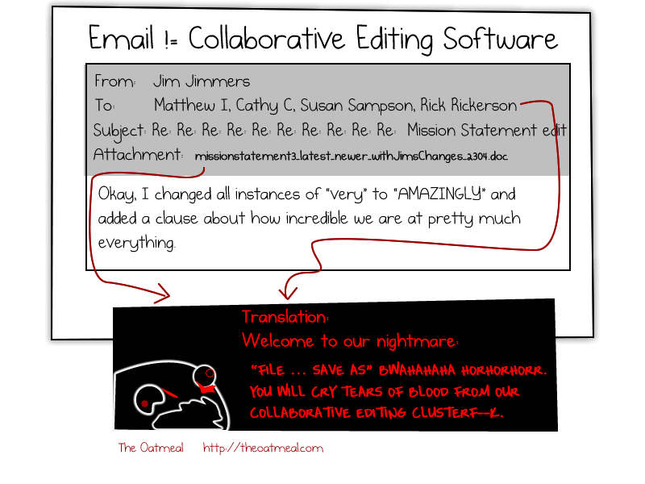
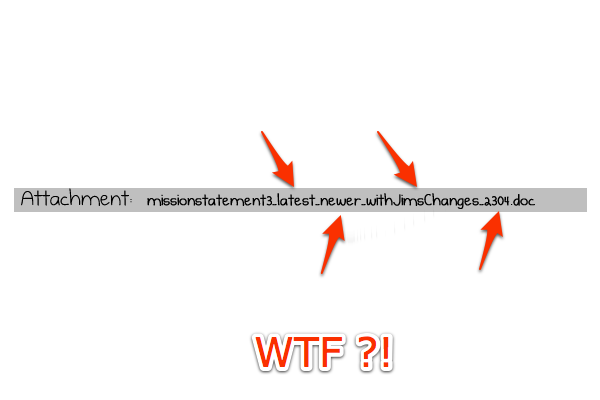

!SLIDE transition=toss

# Let's talk about a non-revisionned collaborative software project
## Bad patterns in non-revisionned code

!SLIDE 

# Start a new project,
# create a file 
## (``.py``, ``.c``, ``.m``, whatever)

!SLIDE

# Add some code 

    @@@ python
    # sum.py    
    def compute_sum(a_list):
        sum = 0
        for i in range(len(a_list)):
            sum += a_list[i]
        return sum

!SLIDE

# Try out a new approach, comment out the old version

    @@@ python
    # sum.py    
    def compute_sum(a_list):
        sum = 0
        #for i in range(len(a_list)):
        #    sum += a_list[i]
        for value in a_list:
            sum += value
        return sum

!SLIDE

# Oh wait, cool new idea

    @@@ python
    # sum.py    
    def compute_sum(a_list):
        #sum = 0
        ##for i in range(len(a_list)):
        ##    sum += a_list[i]
        #for value in a_list:
        #    sum += value
        #return sum
        from operator import add
        return reduce(add, a_list, 0)

!SLIDE

# Looks familiar ?
## The poor readability should strike you

!SLIDE transition=scrollLeft

# Pop Quizz

!SLIDE small

# What does this program do ?

    @@@ python
    #import sys
    #import time
    from time import sleep

    #i = 0
    ## print "i=", i
    #while i < 10:
    #    print i
    #    #i+=1    # 2010-05-02
    #    i = i+1
    #    time.sleep(1) 
    for i in range(10):
        print i
        # time.sleep(1)
        sleep(1)
    #print "done"    
       
    

!SLIDE

# Try again
 
    @@@ python
    from time import sleep

    for i in range(10):
        print i
        sleep(1)

    
!SLIDE  transition=scrollRight

# Readability is important for productivity
## don't undermine this

!SLIDE smaller 

# Code hoarding
## I don't want to throw away code !

    @@@ python
    # sum.py, v0.3
    def compute_sum_v1(a_list):
        sum = 0
        for i in range(len(a_list)):
            sum += a_list[i]
        return sum

    def compute_sum_v2(a_list):
        sum = 0
        for value in a_list:
            sum += value
        return sum

    def compute_sum_v3(a_list):
        from operator import add
        return reduce(add, a_list, 0)

!SLIDE

# On a sufficiently small project, this might work

## but do you really want to maintain 3 versions of the same function? 

!SLIDE

# This is **not** good

!SLIDE bullets incremental

# Now, for the bad part
* what if you **need** to go back to an older, working version?
* also, creating experiments for debugging

!SLIDE bullets incremental

# Reverting commented parts one by one!

* this will be very error prone
* not to mention, unproductive.
* you will probably make a mistake

!SLIDE

## Keypoint:
# Don't manage different versions of your source files **in** the source files

!SLIDE transition=toss

# Enters collaborative work

!SLIDE center 

!SLIDE bullets incremental

# Sharing changes with your team ?

* usb flashdrive !
* email !

!SLIDE full-page-image

Image courtesy of <a rel="cc:attributionURL" property="cc:attributionName" href="http://hyperboleandahalf.blogspot.com/2010/10/god-of-cake.html">Allie Brosh</a> / <a rel="license" href="http://creativecommons.org/licenses/by-nc-nd/3.0/us/">(CC)</a>

!SLIDE  full-page-image

Image courtesy of [Matthew Inman](http://theoatmeal.com/comics/email)

!SLIDE full-page-image

!SLIDE center

!SLIDE center

# Handling concurrent changes ?
## careful line by line review ! 

## again, you will make mistakes

!SLIDE

## Keypoint:
# Detecting and resolving differences in text files is easy to do for a computer 
## let it do the work

!SLIDE

# There has to be a better way

